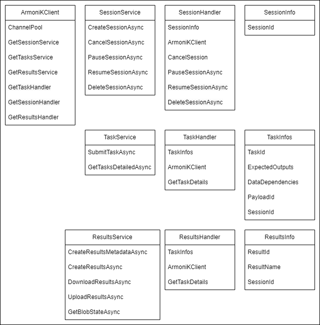

# AEP 3: New C# Extension for ArmoniK

|                   |ArmoniK Enhancement Proposal|
---:                |:---
**AEP**             | 4
**Title**           | Architecture for ArmoniK Extesion development
**Author**          | Italo Aguiar <<iaguiar@aneo.fr>>
**Status**          | Draft
**Type**            | Standard
**Creation Date**   | 2024-05-23

# Abstract

This AEP proposes a new architecture for ArmoniK's extension, aiming to create a standard for extensions development and bring users closer to the core paradigms of ArmoniK. The proposed extension is designed to enhance user interaction, enabling more intuitive and direct integration with ArmoniK.

# Motivation

This AEP aims to create a standard architecture for ArmoniK's extension development. It proposes services decoupling, segregating interfaces to related domains, and enriching domains.

# Proposed Solution

The proposed architecture will:
- Define a clear set of guidelines and standards for extension development.
- Introduce a modular design to ensure extensions can be developed and correctly tested.
- Enhance the user interface to make the integration process more intuitive.

## Specification

### Domain Segregation

To improve clarity and structure, the ArmoniK SDK will keep domain segregation to ensure modularity and ease of use. These domains will encapsulate related services and functionalities, promoting a separation of concerns and enhancing maintainability and scalability:

- **Session Domain**: Responsible for managing sessions and their related operations.
  
- **Data Management Domain**: Manages data entities within ArmoniK, including results and its metadata. This domain provides services for creating, uploading, and downloading data results.

- **Task Management Domain**: Manages tasks, offering functionalities for task submission and monitoring. It ensures tasks are managed efficiently and effectively.

### Handlers

To enrich the behavior within each domain, we introduce the concept of handlers. Handlers enable domains to contain their own specialized behaviors and functionalities. For instance, a `TaskHandler` might offer a extension method to get detailed state information of the task.

### Services

Each domain will contain specific services to encapsulate its functionalities:

- **Session Domain**:
  - **SessionService (`ISessionService`)**: Manages sessions and provides an interface for session-related operations.

- **Data Management Domain**:
  - **ResultsService (`IResultsService`)**: Handles results and metadata (inputs and outputs), representing data entities within ArmoniK. It offers methods for creating, uploading, and downloading results.

- **Task Management Domain**:
  - **TasksService (`ITasksService`)**: Manages tasks, offering functionalities for submitting and monitoring tasks.

### ArmoniKClient

Interaction with ArmoniK will be managed through the `ArmoniKClient`, which oversees all services and channel pools. `ArmoniKClient` exposes functions that allow users to access these services, promoting a cohesive and intuitive user experience:

- **`GetSessionService()`**: Retrieves the service responsible for session management.
- **`GetResultsService()`**: Provides the service for managing data results.
- **`GetTasksService()`**: Accesses the service for task management.

## Copyright

This document is placed in the public domain or under the CC0-1.0-Universal license, whichever is more permissive.